# Claudarity Mermaid Diagrams

This document contains Mermaid diagrams that render in GitHub, GitLab, and many Markdown viewers.

## System Architecture Overview

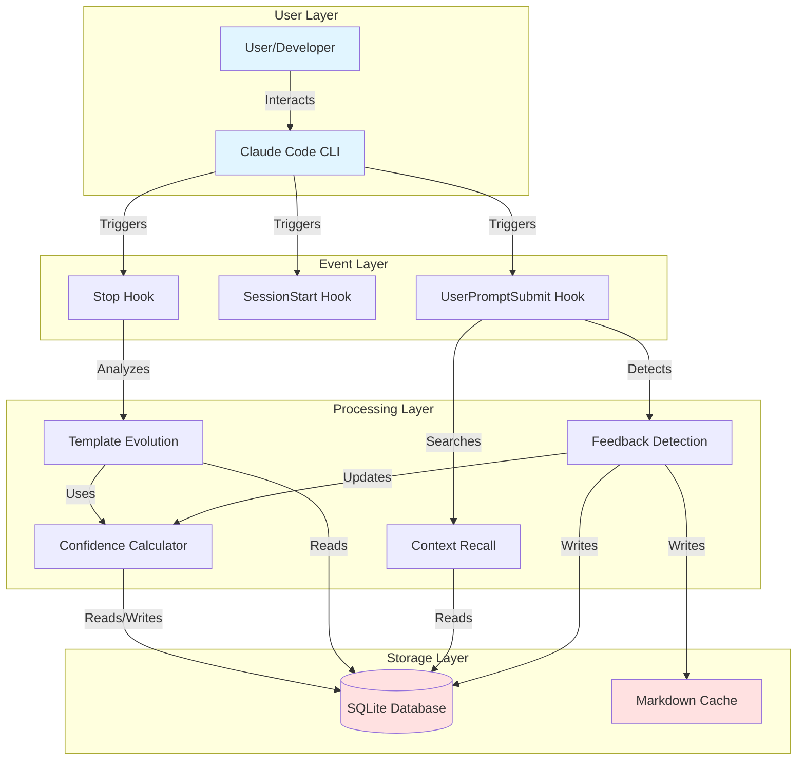

## Reinforcement Learning Loop

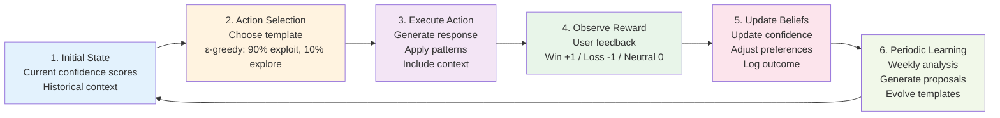

## Feedback Detection Flow

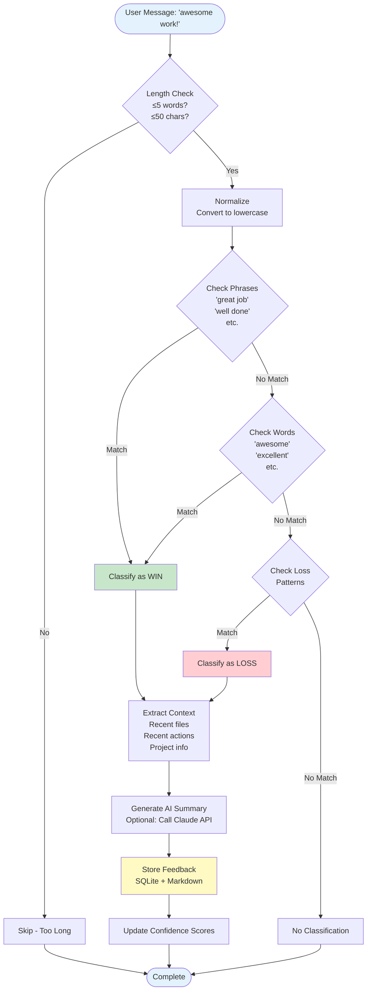

## Template Evolution Workflow

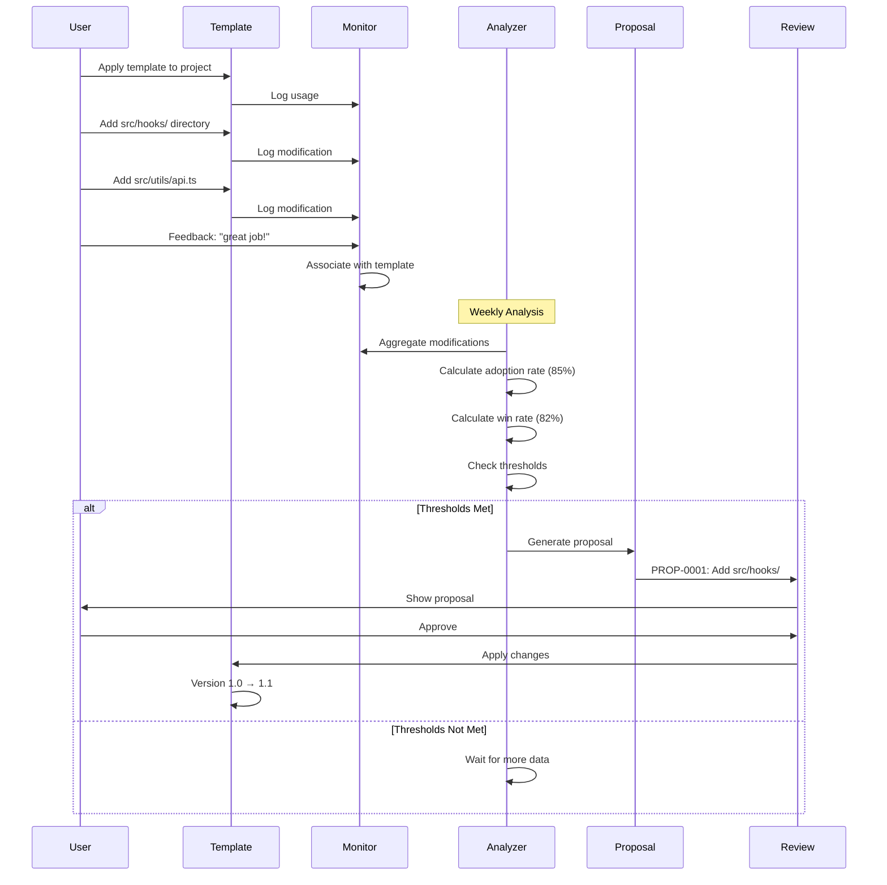

## Confidence Score Calculation

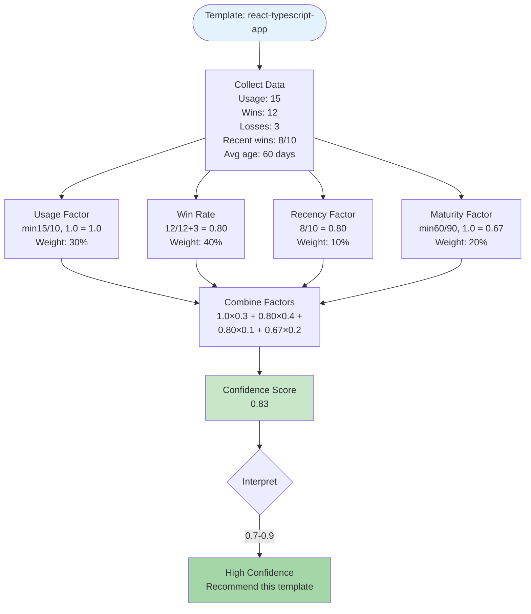

## Hook Execution Pattern

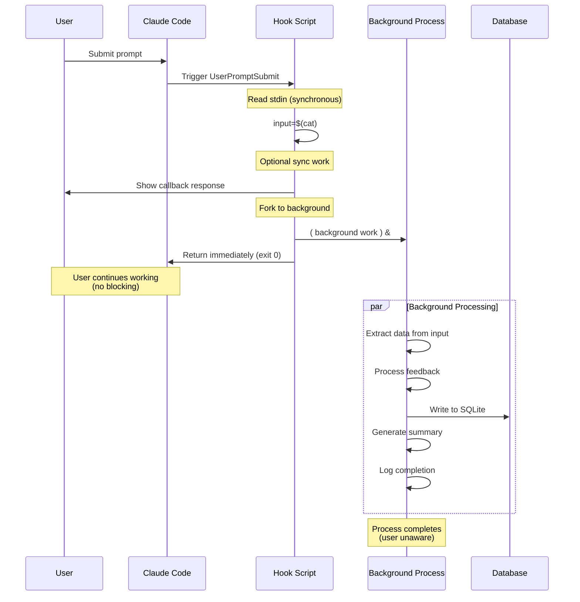

## Data Flow: Feedback to Learning

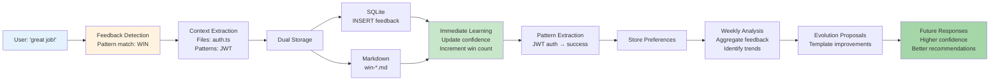

## Database Schema Relationships

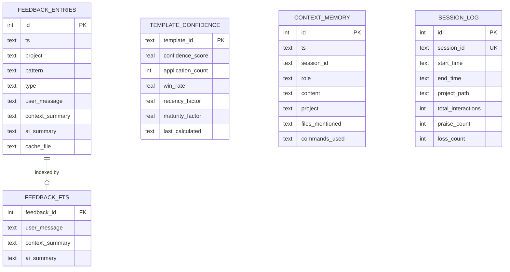

## Migration Phases Timeline

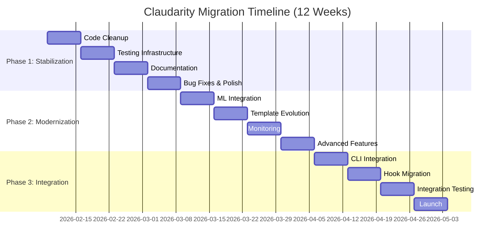

## State Machine: Template Lifecycle

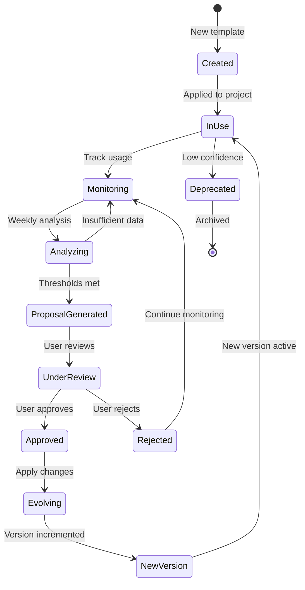

## Component Interaction

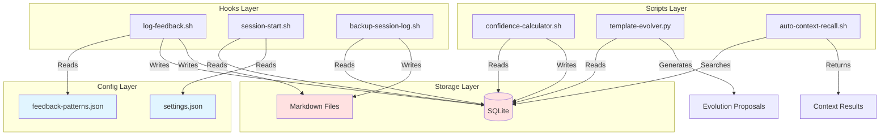

## Confidence Score Distribution

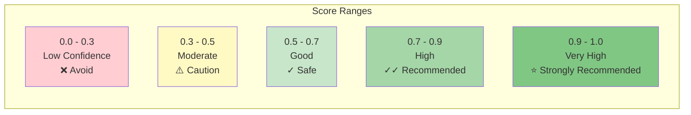

## Usage Instructions

### Viewing Diagrams

These Mermaid diagrams will render automatically in:
- GitHub (native support)
- GitLab (native support)
- VS Code (with Mermaid extension)
- Many Markdown viewers

### Editing Diagrams

1. **Online Editor**: https://mermaid.live/
2. **VS Code**: Install "Markdown Preview Mermaid Support" extension
3. **CLI**: Install `@mermaid-js/mermaid-cli` for PNG/SVG export

### Exporting to Images

```bash
# Install mermaid-cli
npm install -g @mermaid-js/mermaid-cli

# Export to PNG
mmdc -i docs/MERMAID_DIAGRAMS.md -o diagrams/

# Export to SVG
mmdc -i docs/MERMAID_DIAGRAMS.md -o diagrams/ -t svg
```

## References

- Mermaid Documentation: https://mermaid.js.org/
- Mermaid Live Editor: https://mermaid.live/
- GitHub Mermaid Support: https://github.blog/2022-02-14-include-diagrams-markdown-files-mermaid/

---

**Note**: These diagrams complement the text-based diagrams in [DIAGRAMS.md](DIAGRAMS.md). Use whichever format works best for your needs!
